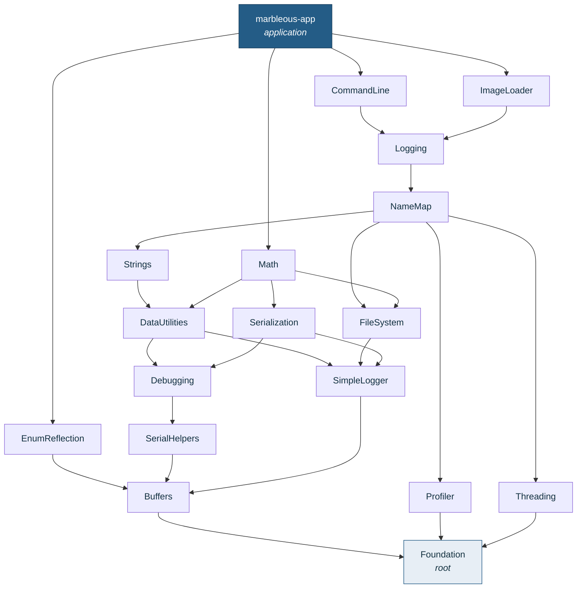
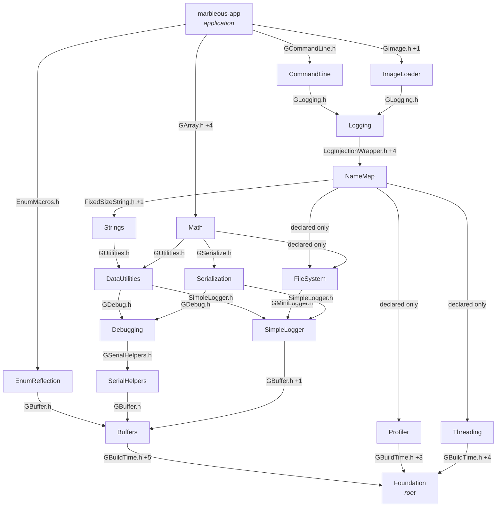

# Repository Dependencies

Generated from `REPO_CONFIGS` in `scripts/project_utils.py` by
`scripts/generate_dependency_graph.py`. Do not edit by hand.

- **Repositories:** 18
- **Dependency edges:** 71
- **Cycles:** 0

The three vendored trees — `glad`, `glfw` and `external` — are omitted:
they have no `ProjectConfig` and are reached by raw include path rather
than through the dependency mechanism.

## Graph

Shown as the transitive reduction: 44 of the 71
declared edges are implied by others, leaving 27 that carry
structure. Arrows point from dependent to dependency.

## Layers

The graph is acyclic, so it has a strict total ordering. A repo at any
level depends only on levels beneath it.

- **L0** — `Foundation`
- **L1** — `Buffers`
- **L2** — `EnumReflection`
- **L3** — `SerialHelpers`
- **L4** — `Debugging`
- **L5** — `SimpleLogger`
- **L6** — `DataUtilities`
- **L7** — `FileSystem`
- **L8** — `Profiler`
- **L9** — `Strings`
- **L10** — `Threading`
- **L11** — `NameMap`
- **L12** — `Logging`
- **L13** — `Serialization`
- **L14** — `Math`
- **L15** — `CommandLine`
- **L16** — `ImageLoader`
- **L17** — `marbleous-app`

## Cycles

None. Every repository can be built, versioned and published on its own.

## Include graph

Repository dependencies exist because of `#include` directives. The
68 cross-repo edges below are backed by 155 distinct
repo/header references, scanned from the generated repositories.

The same spine as above, with each edge labelled by the header that
creates it:

### Every cross-repo edge

`test` marks an edge that exists only because of test code — the library
itself does not need it.

| From | To | Headers | Origin |
| ---- | -- | ------- | ------ |
| `Buffers` | `Foundation` | `GBuildTime.h`, `GMacros.h`, `GPortable.h`, `GPrintfHelpers.h`, `GTypes.h`, `Warnings.h` | lib + test |
| `CommandLine` | `DataUtilities` | `GString.h` | lib |
| `CommandLine` | `Debugging` | `GDebug.h` | lib |
| `CommandLine` | `Foundation` | `GBuildTime.h`, `GPortable.h`, `GTypes.h`, `Warnings.h` | lib + test |
| `CommandLine` | `Logging` | `GLogging.h` | lib |
| `DataUtilities` | `Buffers` | `GBuffer.h` | lib |
| `DataUtilities` | `Debugging` | `GDebug.h` | lib |
| `DataUtilities` | `Foundation` | `GBuildTime.h`, `GMacros.h`, `GPortable.h`, `Warnings.h` | lib |
| `DataUtilities` | `SerialHelpers` | `GSerialHelpers.h` | lib |
| `DataUtilities` | `SimpleLogger` | `SimpleLogger.h` | lib |
| `Debugging` | `Buffers` | `GBuffer.h`, `GUnicode.h` | lib + test |
| `Debugging` | `Foundation` | `GBuildTime.h`, `GEmbeddedData.h`, `GMacros.h`, `GPortable.h`, `GTypes.h`, `Warnings.h` | lib + test |
| `Debugging` | `SerialHelpers` | `GSerialHelpers.h` | lib |
| `EnumReflection` | `Buffers` | `GBuffer.h` | lib |
| `EnumReflection` | `Foundation` | `GBuildTime.h`, `GMacros.h`, `GTypes.h`, `Warnings.h` | lib + test |
| `EnumReflection` | `Serialization` | `GSerialize.h` | test |
| `FileSystem` | `Buffers` | `GUnicode.h` | lib |
| `FileSystem` | `Foundation` | `GBuildTime.h`, `GPortable.h`, `GTypes.h`, `Warnings.h` | lib + test |
| `FileSystem` | `SimpleLogger` | `GMiniLogger.h` | lib |
| `Foundation` | `Buffers` | `GBuffer.h`, `GUnicode.h` | test |
| `ImageLoader` | `FileSystem` | `GFileSystem.h`, `ResourceHelper.h` | lib |
| `ImageLoader` | `Foundation` | `GBuildTime.h`, `GMacros.h`, `GPortable.h`, `GTypes.h`, `Warnings.h` | lib + test |
| `ImageLoader` | `Logging` | `GLogging.h` | lib |
| `ImageLoader` | `Threading` | `tinythread.h` | lib |
| `Logging` | `Buffers` | `GBuffer.h`, `GUnicode.h` | lib |
| `Logging` | `Foundation` | `GBuildTime.h`, `GMacros.h`, `GPortable.h`, `Warnings.h` | lib |
| `Logging` | `NameMap` | `LogInjectionWrapper.h`, `NameMap.h`, `NameMap.hpp`, `NameMapInterface.h`, `NodeVisitorLog.h` | lib |
| `Logging` | `SimpleLogger` | `LoggingMacros.h`, `SimpleLogger.h` | lib |
| `Logging` | `Strings` | `FixedSizeStringInterface.h`, `StringSanitizer.h` | lib |
| `Logging` | `Threading` | `RWLockInterface.h`, `tinythread.h` | lib |
| `Math` | `Buffers` | `GBuffer.h` | lib + test |
| `Math` | `DataUtilities` | `GUtilities.h` | lib |
| `Math` | `Debugging` | `GDebug.h`, `GTrace.h` | lib |
| `Math` | `Foundation` | `GBuildTime.h`, `GMacros.h`, `GPortable.h`, `GTypes.h`, `Warnings.h` | lib + test |
| `Math` | `SerialHelpers` | `GSerialHelpers.h` | lib |
| `Math` | `Serialization` | `GSerialize.h` | lib |
| `NameMap` | `Debugging` | `GDebug.h`, `GTestUtilities.h`, `GTrace.h` | lib + test |
| `NameMap` | `Foundation` | `GBuildTime.h`, `GEmbeddedData.h`, `GMacros.h`, `GPortable.h`, `GTypes.h`, `Warnings.h` | lib + test |
| `NameMap` | `Logging` | `GLogging.h` | test |
| `NameMap` | `SimpleLogger` | `LoggingMacros.h`, `SimpleLogger.h` | test |
| `NameMap` | `Strings` | `FixedSizeString.h`, `FixedSizeStringInterface.h` | lib |
| `Profiler` | `Foundation` | `GBuildTime.h`, `GMacros.h`, `GPortable.h`, `Warnings.h` | lib + test |
| `SerialHelpers` | `Buffers` | `GBuffer.h` | lib |
| `SerialHelpers` | `Foundation` | `GPortable.h`, `GPrintfHelpers.h` | lib |
| `Serialization` | `Buffers` | `GBuffer.h`, `GUnicode.h` | lib + test |
| `Serialization` | `Debugging` | `GDebug.h` | lib |
| `Serialization` | `Foundation` | `GBuildTime.h`, `GPortable.h`, `GTypes.h`, `Warnings.h` | lib + test |
| `Serialization` | `SimpleLogger` | `SimpleLogger.h` | lib |
| `SimpleLogger` | `Buffers` | `GBuffer.h`, `GUnicode.h` | lib |
| `SimpleLogger` | `Foundation` | `GBuildTime.h`, `GMacros.h`, `GPortable.h`, `GTypes.h`, `Warnings.h` | lib + test |
| `Strings` | `DataUtilities` | `GUtilities.h` | lib + test |
| `Strings` | `Debugging` | `GDebug.h`, `GTestUtilities.h` | lib + test |
| `Strings` | `Foundation` | `GBuildTime.h`, `GPortable.h`, `GTypes.h`, `Warnings.h` | lib + test |
| `Strings` | `SimpleLogger` | `SimpleLogger.h` | lib |
| `Threading` | `Foundation` | `GBuildTime.h`, `GMacros.h`, `GPortable.h`, `GTypes.h`, `Warnings.h` | lib + test |
| `marbleous-app` | `Buffers` | `GBuffer.h`, `GUnicode.h` | lib |
| `marbleous-app` | `CommandLine` | `GCommandLine.h` | lib |
| `marbleous-app` | `DataUtilities` | `GUtilities.h` | lib |
| `marbleous-app` | `Debugging` | `GDebug.h` | lib |
| `marbleous-app` | `EnumReflection` | `EnumMacros.h` | lib |
| `marbleous-app` | `Foundation` | `GBuildTime.h`, `GMacros.h`, `GPortable.h`, `GTypes.h`, `Variadic.h`, `Warnings.h` | lib |
| `marbleous-app` | `ImageLoader` | `GImage.h`, `ImageLoader.h` | lib |
| `marbleous-app` | `Logging` | `GLogging.h` | lib |
| `marbleous-app` | `Math` | `GArray.h`, `GArrayOfStructs.h`, `GComponentType.h`, `GQuaternion.h`, `GUnits.h` | lib |
| `marbleous-app` | `NameMap` | `NameMap.h` | lib |
| `marbleous-app` | `Serialization` | `GSerialize.h` | lib |
| `marbleous-app` | `SimpleLogger` | `SimpleLogger.h` | lib |
| `marbleous-app` | `Threading` | `RWLockAtomic.h`, `tinythread.h` | lib |

### Consistency

**Declared but unused (6).** `REPO_CONFIGS` names these
dependencies, but no source includes anything from them. They add
include paths the compiler does not need:

- `Math` → `FileSystem`
- `NameMap` → `DataUtilities`
- `NameMap` → `FileSystem`
- `NameMap` → `Profiler`
- `NameMap` → `SerialHelpers`
- `NameMap` → `Threading`

**Used but undeclared (3).** These includes resolve only
because the include path arrives transitively through another
dependency. They compile today, but would break if that intermediate
dependency were removed:

- `EnumReflection` → `Serialization` &nbsp; (`GSerialize.h`)
- `Foundation` → `Buffers` &nbsp; (`GBuffer.h`, `GUnicode.h`)
- `NameMap` → `Logging` &nbsp; (`GLogging.h`)

## All repositories

| Level | Repo | Kind | Used by | Direct | Transitive | Depends on |
| ----: | ---- | ---- | ------: | -----: | ---------: | ---------- |
| L0 | `Foundation` | library | 17 | 0 | 0 | — |
| L1 | `Buffers` | library | 10 | 1 | 1 | `Foundation` |
| L2 | `EnumReflection` | header-only | 1 | 2 | 2 | `Buffers`, `Foundation` |
| L3 | `SerialHelpers` | header-only | 4 | 2 | 2 | `Buffers`, `Foundation` |
| L4 | `Debugging` | library | 7 | 3 | 3 | `Buffers`, `Foundation`, `SerialHelpers` |
| L5 | `SimpleLogger` | library | 7 | 2 | 2 | `Buffers`, `Foundation` |
| L6 | `DataUtilities` | library | 5 | 5 | 5 | `Buffers`, `Debugging`, `Foundation`, `SerialHelpers`, `SimpleLogger` |
| L7 | `FileSystem` | library | 3 | 3 | 3 | `Buffers`, `Foundation`, `SimpleLogger` |
| L8 | `Profiler` | library | 1 | 1 | 1 | `Foundation` |
| L9 | `Strings` | library | 2 | 4 | 6 | `DataUtilities`, `Debugging`, `Foundation`, `SimpleLogger` |
| L10 | `Threading` | library | 4 | 1 | 1 | `Foundation` |
| L11 | `NameMap` | library | 2 | 9 | 10 | `DataUtilities`, `Debugging`, `FileSystem`, `Foundation`, `Profiler`, `SerialHelpers`, `SimpleLogger`, `Strings`, `Threading` |
| L12 | `Logging` | library | 3 | 6 | 11 | `Buffers`, `Foundation`, `NameMap`, `SimpleLogger`, `Strings`, `Threading` |
| L13 | `Serialization` | library | 2 | 4 | 5 | `Buffers`, `Debugging`, `Foundation`, `SimpleLogger` |
| L14 | `Math` | library | 1 | 7 | 8 | `Buffers`, `DataUtilities`, `Debugging`, `FileSystem`, `Foundation`, `SerialHelpers`, `Serialization` |
| L15 | `CommandLine` | library | 1 | 4 | 12 | `DataUtilities`, `Debugging`, `Foundation`, `Logging` |
| L16 | `ImageLoader` | library | 1 | 4 | 12 | `FileSystem`, `Foundation`, `Logging`, `Threading` |
| L17 | `marbleous-app` | application | 0 | 13 | 17 | `Buffers`, `CommandLine`, `DataUtilities`, `Debugging`, `EnumReflection`, `Foundation`, `ImageLoader`, `Logging`, `Math`, `NameMap`, `Serialization`, `SimpleLogger`, `Threading` |
